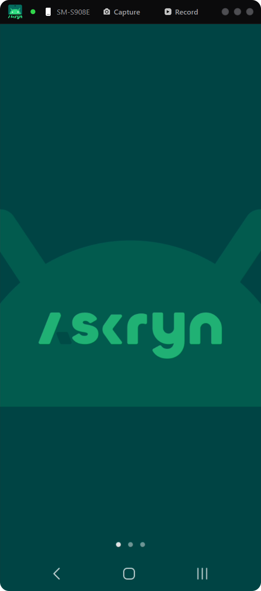
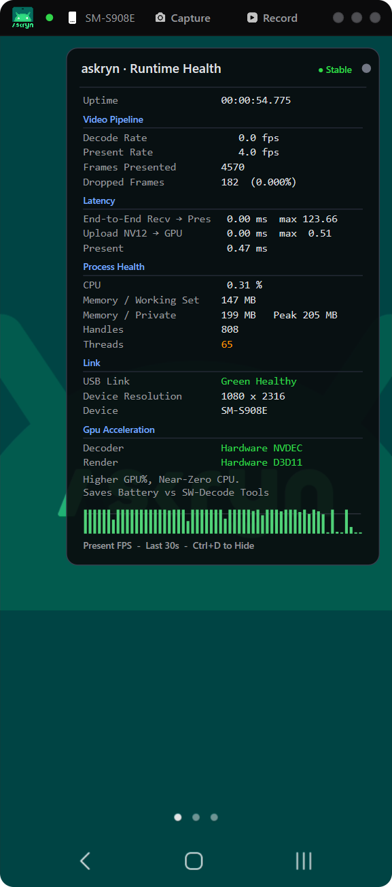
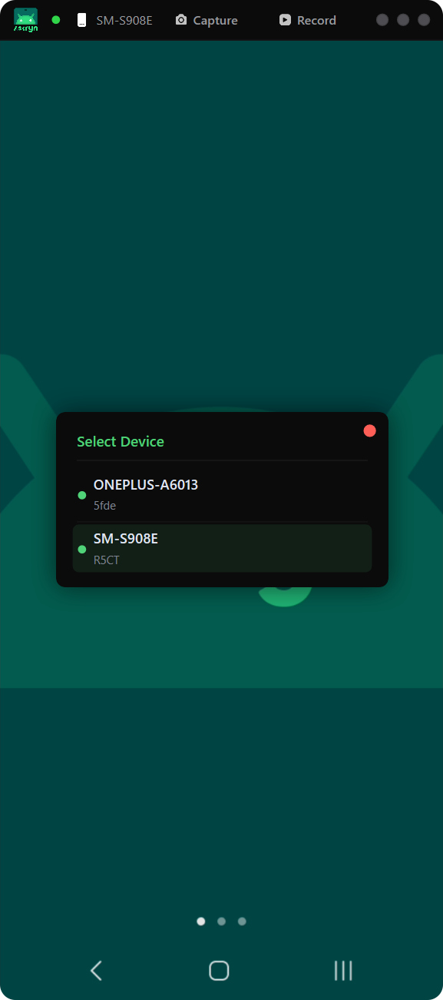

<div align="center">


### Your Androids. On your PC. In one file.

Mirror. Control. Screenshot. Record. Multi-device. Zero bloat.

[](LICENSE)


[**Download**](https://github.com/zncodex/askryn/releases) · [Start](#start) · [Features](#features) · [Shortcuts](#shortcuts) · [FAQ](#faq)

</div>


<div align="center">

&nbsp;&nbsp;

&nbsp;&nbsp;

</div>


## Built different

- **One `.exe`.** No installer. No `Assets/`. No Electron.
- **Instant.** Sub-2 ms recv → present latency. 60 fps. GPU-accelerated.
- **Silent.** No telemetry. No network calls outside your device.
- **Native.** Pure Win32 + D3D11 + D2D1. Not a web app pretending.
- **Self-contained.** ADB tools, Android agent — all bundled inside.

## Features

- **Live mirroring** — 60 fps H.265 (H.264 fallback), hardware-decoded on NVDEC / Quick Sync, sub-2 ms end-to-end latency
- **Full control** — mouse, keyboard, scroll, multi-touch-like gestures
- **Multi-device** — switch between any connected phone instantly via the `▾` picker or `Ctrl+W`, no restart needed
- **Lossless screenshots** — native resolution PNG pulled straight from the device
- **MP4 recording** — variable frame rate, muxed on the fly
- **USB** — plug and play, no extra setup
- **Health overlay** — real-time FPS, latency, GPU/CPU usage, decode/render acceleration mode
- **Zero install** — no APK on the phone, no SDK or runtime required on your PC

## Start

1. Enable **Developer options → USB debugging** on your phone.
2. Plug it in and accept *Allow USB debugging*.
3. Run `askryn.exe`.

No CLI, no config, nothing to install.

## Shortcuts

| Key                 | Action                    |
|---------------------|---------------------------|
| `Esc` / Right-click | Back                      |
| `Ctrl+H`            | Home                      |
| `Ctrl+P`            | Power                     |
| `Ctrl+S`            | PNG screenshot            |
| `Ctrl+R`            | Record to MP4             |
| `Ctrl+W`            | Switch device             |
| `Ctrl+D`            | Toggle health overlay     |
| `Arrow keys`        | D-pad navigation          |
| `Backspace`         | Delete                    |
| `Enter`             | Confirm                   |

## Under the hood

Everything the app needs is packed inside the `.exe` — the Android agent (JAR) and ADB tools. On first launch, `adb.exe` and its two support DLLs are silently extracted next to the exe:

```
📁 anywhere you drop it/
   ├── askryn.exe
   ├── adb.exe           ← extracted on first run
   ├── adbwinapi.dll     ← extracted on first run
   └── adbwinusbapi.dll  ← extracted on first run
```

The Android agent is pushed to `/data/local/tmp/` on the phone over ADB sync and runs via `app_process` — no APK install required. Video travels as H.265 (H.264 fallback) from the device → Media Foundation MFT (hardware decode) → NV12 → 3-slot ring buffer → D3D11 flip-discard swap chain with `ALLOW_TEARING` on fresh frames and vsync pacing when idle. The render thread only runs when there is actually a new frame or UI change, so idle GPU/CPU drop to near zero. The C++ runtime is statically linked — no Visual C++ Redistributable needed.

## Requires

- Windows 10 1903+ or Windows 11 (x64)
- Android 11+ with USB debugging enabled

No ADB, no SDK, no runtime — nothing to install.

## FAQ

**Do I need to install adb or platform-tools?**
No. ADB tools are bundled inside the exe and managed automatically.

**Do I need the Visual C++ Redistributable?**
No. The runtime is statically linked inside the exe.

**Data collection?**
None. No telemetry, no network traffic to anything but your device.

**Source available?**
No, binary-only release.

## License

Apache 2.0. © 2026 **zncodex**. See [LICENSE](LICENSE).

## Not a scrcpy fork

askryn is written from scratch with a native Win32 + D3D11 UI. The only thing in common with scrcpy is the `app_process` + Java server pattern — standard across all Android mirror tools. No scrcpy code is used.


<div align="center">
<sub>android mirror windows · scrcpy alternative · control android from pc · portable android mirror · record android mp4 · multi device android · c++ android remote</sub>
</div>
